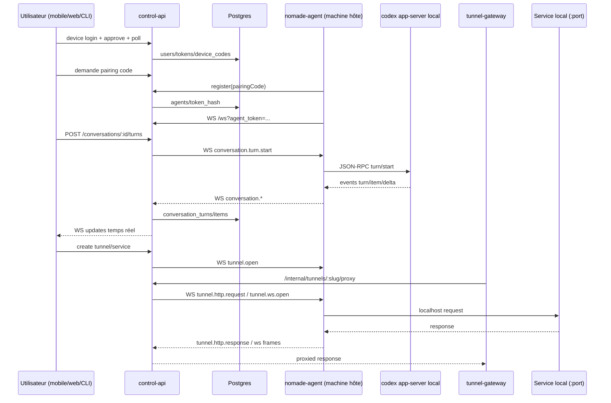

# Contexte Projet – Nomade for Codex (pour ChatGPT)

> Objectif: donner un contexte complet, concis et opérationnel à ChatGPT pour répondre correctement sur ce codebase.
> Source: état courant du workspace local (incluant des changements non commités) au 3 avril 2026.

## 1) Résumé exécutif

`Nomade for Codex` est un monorepo qui permet de piloter un agent `codex` distant (sur une machine hôte), depuis une app mobile/web, avec:

- Authentification device-code + refresh token
- Appairage machine hôte (`agent`) avec quotas de devices (plan)
- Exécution de sessions shell distantes
- Conversations pilotant `codex app-server` (threads/turns/items)
- Tunnels preview publics (`<slug>.<preview-domain>`) vers services locaux
- WebSocket broker temps réel entre utilisateurs et agents
- Gestion de services de dev (start/stop/health/proxy/tunnel)
- Base E2E (enveloppes chiffrées XChaCha20-Poly1305 signées Ed25519)

Stack principale:

- Backend: Node.js 20, TypeScript, Express, WS, Postgres
- Mobile: Flutter (Provider + HTTP + WebSocket)
- Monorepo npm workspaces

## 2) Arborescence utile

- `services/control-api`: API centrale + auth + DB + broker WS + orchestration services/tunnels
- `services/tunnel-gateway`: gateway publique preview (HTTP + WS)
- `agent/nomade-agent`: CLI/daemon hôte (login/pair/run), exécution shell, bridge Codex app-server
- `apps/mobile`: app Flutter (auth, agents, workspaces, conversations, services, tunnels)
- `packages/shared`: types partagés, IDs/tokens, crypto/E2E
- `scripts/dev-full.sh`, `scripts/dev-stop.sh`: boucle dev rapide
- `deploy/selfhost`: compose dev et self-host

## 3) Flux bout-en-bout (haut niveau)



## 4) Composants et responsabilités

### 4.1 `control-api`

Responsabilités clés:

- Auth:
  - Device code start/approve/poll
  - Scan secure flow (mobile + host key exchange)
  - Refresh / logout
  - Web session cookie + pages `/web/*`
- OIDC login optionnel (`/auth/oidc/start`, `/auth/oidc/callback`)
- Billing Stripe (checkout, portal, webhook)
- Pairing agent + quotas devices par plan
- CRUD workspaces / conversations / turns / sessions / tunnels
- Gestion services dev (création, start/stop, health, dépendances, env templating)
- Broker WS user<->agent
- Proxy interne tunnel pour gateway (`/internal/tunnels/:slug/proxy` + upgrade WS interne)
- Diagnostics tunnel (transport/upstream app)
- Rate-limiting DB-backed + audit events

Fichiers centraux:

- `services/control-api/src/server.ts`
- `services/control-api/src/ws-hub.ts`
- `services/control-api/src/service-manager.ts`
- `services/control-api/src/repositories.ts`
- `services/control-api/src/db.ts`

### 4.2 `tunnel-gateway`

Responsabilités:

- Résout le `slug` depuis le host `<slug>.<preview-domain>`
- Récupère token tunnel via query/header/cookie/référer
- Forward HTTP vers `control-api /internal/tunnels/:slug/proxy`
- Forward WS vers `control-api /internal/tunnels/:slug/ws`
- Persiste token en cookie HttpOnly `nomade_tunnel_token`
- Filtre hop-by-hop headers

Fichier central: `services/tunnel-gateway/src/server.ts`

### 4.3 `nomade-agent`

CLI:

- `login`: device code (mode `scan_secure` par défaut), QR, poll, session locale
- `whoami`: vérifie identité + entitlements
- `pair`: enregistre la machine comme agent
- `run`: daemon WS + runtime

Daemon runtime:

- WS vers control-api (`/ws?agent_token=...`)
- Gère `session.create/input/terminate` via processus shell local
- Gère `tunnel.http.request` et `tunnel.ws.*` vers localhost
- Gère `conversation.turn.start/interrupt` via `codex app-server`
- Remonte événements conversation/tunnel/session vers control-api
- Active E2E si session utilisateur contient clé E2E

Fichiers centraux:

- `agent/nomade-agent/src/runner.ts`
- `agent/nomade-agent/src/conversation-manager.ts`
- `agent/nomade-agent/src/codex-app-server.ts`
- `agent/nomade-agent/src/user-auth.ts`

### 4.4 App mobile Flutter

Capacités:

- Login device-code (actuellement flow email + approve legacy)
- Gestion agents/workspaces/conversations
- Envoi de prompts + options Codex (model, approvalPolicy, sandboxMode, effort, collaborationMode, skills)
- Timeline conversation temps réel (items/deltas/plans/server-requests)
- Gestion services dev (start/stop/state)
- Gestion tunnels (create/open/rotate/close)
- Toggle `trusted dev mode` workspace
- Import et réparation d’historique Codex
- UI de debug conversation + trace runtime
- Outil “Approve secure scan” (quand utilisateur déjà auth)

Fichiers centraux:

- `apps/mobile/lib/providers/nomade_provider.dart`
- `apps/mobile/lib/api/nomade_api.dart`
- `apps/mobile/lib/screens/home_screen.dart`

## 5) API REST (surface utile)

### Auth

- `POST /auth/device/start`
- `POST /auth/device/approve`
- `POST /auth/device/scan-approve`
- `POST /auth/device/scan-host-complete`
- `POST /auth/device/scan-mobile-ack`
- `POST /auth/device/poll`
- `POST /auth/refresh`
- `POST /auth/logout`

### User / billing / agents

- `GET /me`
- `GET /me/entitlements`
- `POST /billing/checkout-session`
- `POST /billing/portal-session`
- `POST /agents/pair`
- `POST /agents/register`
- `GET /agents`
- `POST /agents/:agentId/codex/import`
- `GET /agents/:agentId/codex/options`

### Workspaces / services / conversations / sessions / tunnels

- `POST /workspaces`
- `GET /workspaces`
- `GET /workspaces/:workspaceId/dev-settings`
- `PATCH /workspaces/:workspaceId/dev-settings`
- `GET /workspaces/:workspaceId/services`
- `POST /workspaces/:workspaceId/services`
- `PATCH /services/:serviceId`
- `POST /services/:serviceId/start`
- `POST /services/:serviceId/stop`
- `GET /services/:serviceId/state`
- `POST /conversations`
- `GET /conversations`
- `GET /conversations/:conversationId/turns`
- `POST /conversations/:conversationId/turns`
- `POST /conversations/:conversationId/turns/:turnId/interrupt`
- `POST /sessions`
- `GET /sessions`
- `POST /tunnels`
- `GET /tunnels`
- `POST /tunnels/:tunnelId/issue-token`
- `POST /tunnels/:tunnelId/rotate-token`
- `DELETE /tunnels/:tunnelId`

### Interne gateway

- `POST /internal/tunnels/:slug/proxy` (protégé par `x-gateway-secret`)
- Upgrade WS interne: `/internal/tunnels/:slug/ws`

## 6) WebSocket protocol (résumé)

Connexion:

- User socket: `/ws?access_token=<jwt>`
- Agent socket: `/ws?agent_token=<opaque>`

User -> Agent (via control-api):

- `session.create`, `session.input`, `session.terminate`
- `conversation.turn.start`, `conversation.turn.interrupt`
- `conversation.server.response`
- `tunnel.open`, `tunnel.http.request`, `tunnel.ws.*`

Agent -> User (via control-api):

- `session.output`, `session.status`
- `conversation.thread.started`, `conversation.turn.started`, `conversation.item.*`, `conversation.turn.*`
- `conversation.server.request`, `conversation.server.request.resolved`
- `tunnel.status`, `tunnel.http.response`, `tunnel.ws.*`
- `agent.heartbeat`

## 7) Modèle de données Postgres (tables clés)

Auth / identité:

- `users`
- `device_codes`
- `device_scan_flows`
- `user_devices`
- `refresh_tokens`

Billing / quotas:

- `billing_customers`
- `subscriptions`
- `device_entitlements`

Agents / exécution:

- `pairings`
- `agents`
- `workspaces`
- `sessions`

Conversations:

- `conversations`
- `conversation_turns`
- `conversation_items`

Tunnels / services dev:

- `tunnels`
- `workspace_dev_settings`
- `dev_services`
- `dev_service_runtime`

Ops:

- `audit_events`
- `rate_limits`
- `system_flags`

## 8) Sécurité et règles importantes

- `JWT_SECRET` et `INTERNAL_GATEWAY_SECRET` obligatoires et forts (validation de robustesse au boot)
- Tokens sensibles stockés hashés (`refresh`, `agent`, `tunnel`, `pairing`)
- Refresh tokens one-time (revoked on use)
- Rate-limiting applicatif en DB (`rate_limits`)
- `trustedDevMode=true` enlève l’exigence de token tunnel (à utiliser seulement en environnement de confiance)
- Web session cookie: HttpOnly + SameSite Lax (+ Secure si `APP_BASE_URL` en HTTPS)

## 9) E2E (état actuel)

Le projet contient une base E2E utilisable:

- Enveloppe: `xchacha20poly1305` + signature `ed25519`
- Session locale peut stocker:
  - `rootKey`, `epoch`, device keys, peers, seq counters
- L’agent chiffre/déchiffre certains payloads sessions/conversations quand runtime E2E actif
- Le flow `scan_secure` fait une phase d’échange de clé host/mobile

Points à noter:

- Le login mobile principal reste orienté `device/approve` avec email (legacy), tandis que le flow scan sécurisé est exposé séparément dans l’app
- Donc en prod “hardened”, il faut aligner le flow mobile avec auth web/OIDC et scan secure

## 10) Exécution locale

### Fast path

- `npm run dev:full -- you@example.com`
- `npm run dev:stop`

`dev:full`:

- monte Docker (Postgres + control-api + gateway)
- active fallback local (`DEV_LOGIN_ENABLED=1`, `LEGACY_DEVICE_APPROVE_ENABLED=1`)
- auth auto, pairing auto si nécessaire
- démarre agent local
- lance Flutter app

### Démarrage manuel

- `npm install`
- `npm run build && npm test`
- `npm run dev:up`
- `npm run dev:logs`
- agent:
  - `npm --workspace agent/nomade-agent run login -- --server-url http://localhost:8080`
  - `npm --workspace agent/nomade-agent run pair -- --server-url http://localhost:8080`
  - `npm run dev:agent:run`

## 11) Déploiement / self-host

- Compose dev: `deploy/selfhost/docker-compose.dev.yml`
- Compose self-host: `deploy/selfhost/docker-compose.yml`
- Dockerfiles:
  - `services/control-api/Dockerfile`
  - `services/tunnel-gateway/Dockerfile`

Variables critiques:

- `DATABASE_URL`
- `JWT_SECRET`
- `INTERNAL_GATEWAY_SECRET`
- `PREVIEW_BASE_DOMAIN`
- `PREVIEW_BASE_ORIGIN`
- `APP_BASE_URL`
- OIDC `OIDC_*` (si SSO)
- Stripe `STRIPE_*` (si billing)

## 12) Limites / pièges connus

- Session runtime shell: interactif via process shell, pas un PTY natif complet
- Agent: en cas de fermeture WS, le process `run` termine (attendu pour supervision externe)
- Le document `docs/architecture.md` mentionne encore une limite WS tunnel qui est désormais implémentée dans le code actuel
- Mobile login “email + approve” dépend d’un mode legacy; pour un SaaS durci il faut flow auth web/OIDC propre

## 13) Points d’attention pour répondre à des questions techniques

Quand tu réponds sur ce projet:

- Prends `server.ts` (control-api) comme source principale des contrats API
- Prends `ws-hub.ts` + `runner.ts` comme source de vérité du protocole WS
- Prends `service-manager.ts` pour la logique services/tunnels
- Prends `conversation-manager.ts` + `codex-app-server.ts` pour la logique turn/thread Codex
- Vérifie toujours si la réponse dépend de l’état `trustedDevMode` ou agent online/offline
- Distingue clairement:
  - flux REST (persisté DB)
  - flux WS temps réel
  - état dérivé UI mobile

## 14) Prompt prêt-à-coller (optionnel)

```text
Tu es mon assistant technique sur le projet "Nomade for Codex".
Contexte:
- Monorepo Node/TypeScript + Flutter.
- Composants: control-api (auth/API/WS/DB), tunnel-gateway (preview proxy HTTP+WS), nomade-agent (daemon host + bridge codex app-server), mobile app (pilotage agent/workspace/conversation/services/tunnels).
- Protocoles: REST + WebSocket user/agent.
- DB: Postgres (users, device_codes, agents, workspaces, sessions, conversations, turns/items, tunnels, dev_services).
- Auth: device code + refresh; pairing code pour enregistrer un agent.
- Convos: control-api envoie conversation.turn.start à l’agent, l’agent pilote codex app-server et remonte les events.
- Tunnels: gateway -> control-api interne -> agent -> localhost service.
- Important: trustedDevMode peut supprimer l’exigence token pour les tunnels.

Quand je pose une question:
1) base-toi d’abord sur les fichiers serveur/runtime concernés,
2) explicite les hypothèses,
3) propose des étapes concrètes (debug/fix/implémentation/tests),
4) mentionne les impacts API/WS/DB si applicables.
```

